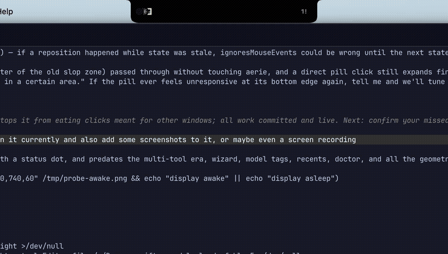

<p align="center">
  
</p>

<p align="center">
Agent status in the MacBook notch — an aerie is an eagle's nest built high on a cliff face,<br>
which is where your agents now roost, watching.
</p>

<p align="center">
  
</p>

aerie watches every AI coding agent running on your machine — **Claude Code,
Codex CLI, Antigravity CLI, Cursor, opencode, Pi, Gemini CLI, and Copilot
CLI** — and lives in the notch. Free, local, no accounts, no telemetry.

- **Idle**: invisible. The widget tucks behind the physical notch; clicks
  pass through.
- **Agents working**: the notch grows wings — an overlapped badge stack of
  each running tool's logo on the left, and on the right either the solo
  session's running duration or, for a fleet, the session count.
- **Agent blocked** (permission prompt): that tool's badge pulses red and
  the right wing shows the blocked count (`1!`). Only genuine blockers
  pulse — an agent that merely *finished* never flashes at you.
- **Agent finished**: a 5-second completion linger — green check, tool
  badge, total runtime — then the notch exhales back to invisible.

Click the notch (or enable hover in settings) to expand the panel: one row
per session with tool badge, project, **model tag**, current activity
(derived from hook payloads — "editing Daemon.swift", "running: pytest"),
and age. A collapsed **RECENT** section lists what finished lately. The
gear opens settings; the first launch opens a setup wizard that installs
hooks into whichever tools you enable.

## Beyond monitoring

- **Approve from the notch** (opt-in per tool): when an agent hits a
  permission prompt, an approval card appears with the FULL command —
  never truncated — plus Allow (⌘Y), Deny (⌘N), and "use terminal" (Esc).
  Ignoring it is always safe: the request falls back to the tool's own
  terminal prompt at timeout. The collapsed pill can never approve;
  Allow is briefly disarmed after the card appears so a stray keystroke
  can't approve something you haven't seen. Claude and Codex support
  allow/deny; Cursor is veto-only (its hook `allow` is unreliable
  upstream). Enabling Claude approval adds latency to matched tool calls
  — an allowlist mirror skips the notch for commands your settings
  already auto-allow.
- **Jump to terminal**: click a session row to focus the pane it lives in
  — tmux pane, iTerm2 tab, or Terminal.app tab (AppleScript needs a
  one-time automation consent); other terminals get app activation. The
  approval card has a jump button too: go look before you decide.
- **Sound alerts**: short synthesized cues (approval, needs-input,
  completion) — volume + mute in settings.
- **Usage bars** (opt-in): local-only quota tracking. Codex is read from
  its session files; Claude via a statusline wrapper that tees
  `rate_limits` while passing your existing statusline through untouched.

## How it works

One binary, three roles:

- `aerie app` — the GUI (LaunchAgent-managed accessory app). Also runs the
  Unix-socket listener at `~/.aerie/daemon.sock` in-process. Socket reads
  happen on a dedicated I/O queue with hard size/deadline caps, so a slow
  or buggy client can never wedge the daemon.
- `aerie hook <Event> [--source <tool>]` — invoked by each tool's hook
  system; reads the hook JSON on stdin, forwards a compact event over the
  socket (150 ms timeout, always exits 0 — a dead app never blocks an
  agent CLI).
- `aerie install | uninstall | status | doctor | approve | deny | send | reset | quit`.

**Per-tool integration** (all opt-in via the wizard or settings):

| tool | mechanism | approval |
|---|---|---|
| Claude Code | hook entries merged into `~/.claude/settings.json` | allow / deny |
| Codex CLI | `~/.codex/hooks.json` (trust once via `/hooks` in codex) | allow / deny |
| Antigravity CLI | `~/.gemini/antigravity-cli/hooks.json` | — |
| Cursor (IDE + CLI) | `~/.cursor/hooks.json` (shared schema) | deny only |
| opencode | generated Bun plugin at `~/.config/opencode/plugins/aerie.js` | — |
| Pi | generated extension at `~/.pi/agent/extensions/aerie-status.ts` | — |
| Gemini CLI (legacy) | hook entries merged into `~/.gemini/settings.json` | — |
| Copilot CLI | manifest at `~/.copilot/hooks/aerie.json` | — |
| Amp | detection only (its hooks can't run external commands yet) | — |

JSON configs are merged append-only — existing hooks are preserved, a
timestamped backup is taken first, malformed configs abort the install
rather than being overwritten, and writes go *through* symlinks so
dotfiles-managed configs stay symlinked. Model names come from hook
payloads where available (Codex, Cursor) or the transcript tail (Claude).

**State machine**: per-`session_id` rows (`idle` / `working` /
`needsInput`) driven by each tool's lifecycle events, mapped onto one
vocabulary (`SessionStart`, `UserPromptSubmit`, `PreToolUse`,
`PostToolUse`, `Notification`, `Stop`, `SessionEnd`). TTL sweeps demote or
reap sessions whose terminal died without a goodbye (working→idle 15 m,
needsInput→idle 2 h, idle→recents 1 h). Ended sessions land in a 20-entry
recents ring — summaries only, never transcripts or commands.

## Install

```sh
brew install trsvsr/aerie/aerie
aerie install     # LaunchAgent + Claude Code hooks; wizard handles the rest
```

Restart running agent sessions to pick up the hooks. `aerie uninstall`
reverses everything.

### Build from source

No Homebrew, or want to hack on it:

```sh
swift build -c release
cp .build/release/aerie ~/.local/bin/aerie
~/.local/bin/aerie install
```

### Troubleshooting

When something isn't reporting:

```sh
aerie doctor
```

prints a per-tool table — detected? hooks installed? events actually seen?
— plus the ages of the last captured hook payloads
(`~/.aerie/last-payloads/`, useful when a tool changes its schema).

## Dev

```sh
swift test                     # SessionStore / ActivityFormatter / HooksPatcher
swift run aerie app            # run UI in foreground (logs to stderr)
scripts/demo.sh                # drive 3 fake sessions through the lifecycle
aerie send --session s1 --event PreToolUse --source codex \
  --cwd /tmp/x --tool shell --command "pytest" --model gpt-5.3-codex
aerie status
```

After rebuilding while the app runs: `rm ~/.local/bin/aerie && cp ...` —
overwriting a running binary in place gets subsequent hook invocations
killed by code-signature invalidation.

## Notes

- On a notchless display (clamshell + external) the widget renders as a
  small top-center pill.
- Hide-in-fullscreen is on by default (detected via the window server's
  fullscreen-backdrop window — menu-bar heuristics don't work).
- If another notch app (NotchNook, boringNotch, Peninsula, TopNotch) is
  running, aerie logs a warning and carries on — you probably want only
  one of them alive.
- `~/.aerie` is `0700`; the socket, log, and payload snapshots are `0600`.
